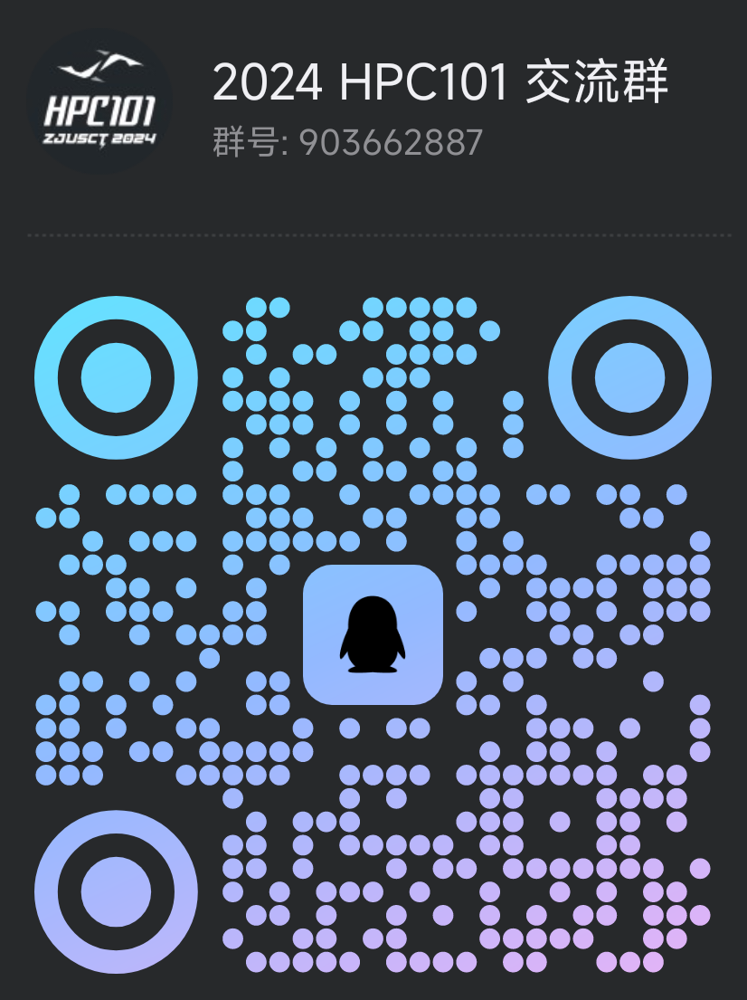

# 欢迎来到 HPC101 超算短学期（2024）

本网站描述了课程中所有实验，如有疑问请及时联系各位助教。

## 选课报名

!!! quote inline end ""

    

欢迎扫码进入 2024 HPC101 课程交流群了解更多信息：

!!! warning "本课程不设置在选课系统中，有意的同学务必提前报名。"

请将报名材料发送到邮箱：

- 邮箱：`mail@zjusct.io`
- 邮件标题：`【2024 短学期报名表】姓名 学号`，例：`【2024 短学期报名表】张三 3220100001`
- 邮件内容：个人联系方式（邮箱、电话、QQ、微信等）
- 邮件附件：HPL 实验报告或个人简介**至少一个**
- 截止时间：6 月 7 日（周五）晚 23:59

我们会优先考虑实验完成度高的同学。同时，时间充裕的同学还可以尝试向量化实验（非必需，若有尝试的可以一并将修改过的代码等发送到报名邮箱，无需报告）。而且实验本身是作为小学期的一次作业使用的。欢迎大家踊跃报名！

## 课程安排

课程大纲（拟，日期和具体内容会根据实际情况调整；除特殊说明外上课时长为半天）：

| 时间 | 内容安排                   | 讲师            |
| ---- | -------------------------- | --------------- |
| 7.1  | 超算概述                   | 陈建海老师      |
| 7.2  | 体系结构与高性能基础       | 何水兵老师/潘哲 |
| 7.3  | 高性能计算方法学           | 耿华            |
| 7.4  | 集群软硬件及运维基础       | 朱宝林          |
| 7.5  | 休息（HPC-PL）             | /               |
| 7.6  | 向量化并行计算基础         | 谢俊            |
| 7.7  | Cuda C 编程基础            | 王则可老师/孙杰 |
| 7.8  | OpenMP/MPI 并行计算基础    | 林熙/郭佳瑞     |
| 7.9  | 高性能计算高级话题         | 王则可老师      |
| 7.10 | 休息                       | /               |
| 7.11 | 机器学习基础               | 黄锦骏          |
| 7.12 | 性能分析技术基础 Profiling | 并行科技        |
| 7.13 | 机器学习高级话题           | 张寅老师        |
